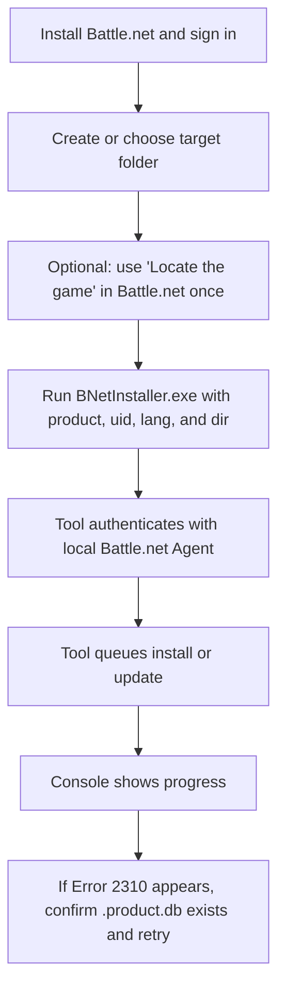

# Battle.Net Installer

Install, update, or repair Blizzard games through the locally installed Battle.net Agent.

This repository is an unofficial maintenance fork of [barncastle/Battle.Net-Installer](https://github.com/barncastle/Battle.Net-Installer). It keeps the original project history intact and adds a maintained fix for Battle.net `Error 2310` plus a few install-flow quality improvements.

## Maintenance Fork

- Upstream project: [barncastle/Battle.Net-Installer](https://github.com/barncastle/Battle.Net-Installer)
- Maintained fork: [DokPlay/Battle.Net-Installer](https://github.com/DokPlay/Battle.Net-Installer)
- Recommended binary: download the latest release from [Releases](https://github.com/DokPlay/Battle.Net-Installer/releases/latest)

At the time of writing, the upstream repository does not publish an explicit `LICENSE` file. Because of that, this repository should be treated as a maintained fork of the original project, not as a newly relicensed codebase.

## What This Tool Does

This tool talks to the locally installed Battle.net Agent and can:

- queue a game install
- continue an update into an existing folder
- run a repair
- report progress in the console

Use it only with products that are already available to your Blizzard account. Product availability may still depend on Blizzard account, platform, and regional policies.

## Quick Start

If you are using the prebuilt `EXE` from Releases, you do not need to install the .NET runtime separately because the release build is self-contained.

### Before You Run It

1. Install Battle.net Desktop App.
2. Sign in to Battle.net at least once.
3. Create or choose the target game folder.
4. If Battle.net does not recognize the folder, open Battle.net and use `Locate the game` for that folder once.
5. If that step succeeds, the folder will usually contain a hidden `.product.db` file.

### Download and Run the Release Binary

1. Download the latest `BNetInstaller.exe` from [Releases](https://github.com/DokPlay/Battle.Net-Installer/releases/latest).
2. Put the `EXE` in any folder you want, for example `C:\Tools\BNetInstaller`.
3. Open `Command Prompt` or `PowerShell`.
4. Change to the folder that contains the `EXE`.
5. Run the command with your product values.

Command Prompt example:

```bat
cd /d C:\Tools\BNetInstaller
BNetInstaller.exe --prod s2 --uid s2_enUS --lang enUS --dir "D:\Battle.net\StarCraft II"
```

PowerShell example:

```powershell
Set-Location "C:\Tools\BNetInstaller"
.\BNetInstaller.exe --prod s2 --uid s2_enUS --lang enUS --dir "D:\Battle.net\StarCraft II"
```

## Installation Flow



## Command Syntax

```text
BNetInstaller.exe --prod <TACT_PRODUCT> --uid <AGENT_UID> --lang <LOCALE> --dir "<INSTALL_DIRECTORY>"
```

### Arguments

| Argument | Required | Description |
| ------- | ------- | ----------- |
| `--prod` | Yes | TACT product code |
| `--uid` | Yes | Battle.net Agent UID. This may differ from the TACT product |
| `--lang` | Yes | Game or asset locale |
| `--dir` | Yes | Installation directory |
| `--repair` | No | Run repair instead of install/update |
| `--verbose` | No | Enable verbose progress output |
| `--post-download` | No | Launch a file or app after a successful download |
| `--help` | No | Show command help |

### Supported Locale Values

The CLI accepts these locale values:

`arSA`, `enSA`, `deDE`, `enUS`, `esMX`, `ptBR`, `esES`, `frFR`, `itIT`, `koKR`, `plPL`, `ruRU`, `zhCN`, `zhTW`

This fork normalizes locale casing internally, so the agent requests are sent in the format Battle.net expects.

## How To Find `--prod` and `--uid`

- TACT products and Agent UIDs can be found on [wowdev.wiki/TACT#Products](https://wowdev.wiki/TACT#Products)
- only active products are expected to work
- some Agent UIDs include a locale suffix, for example `s2_enUS`
- if the target directory already contains the product and an update is available, the product will usually continue as an update rather than a clean install

## Common Examples

### Install or Continue an Existing Download

```bat
BNetInstaller.exe --prod s2 --uid s2_enUS --lang enUS --dir "D:\Battle.net\StarCraft II"
```

### Run a Repair

```bat
BNetInstaller.exe --prod s2 --uid s2_enUS --lang enUS --dir "D:\Battle.net\StarCraft II" --repair
```

### Verbose Progress Output

```bat
BNetInstaller.exe --prod s2 --uid s2_enUS --lang enUS --dir "D:\Battle.net\StarCraft II" --verbose
```

## Error 2310

### What It Usually Means

`Error 2310` usually means the Battle.net Agent rejected the install request for the selected folder or its metadata.

### Recommended Fix

1. Open the Battle.net client.
2. Go to the game page you want to install.
3. Click `Locate the game`.
4. Select the exact target folder you plan to use with this tool.
5. Confirm that a hidden `.product.db` file now exists in that folder.
6. Run `BNetInstaller.exe` again with the same folder.

This maintenance fork also prints a preflight warning when `.product.db` is missing and gives a clearer console message when `2310` occurs.

## Build From Source

If you prefer to build the project yourself, you need the .NET 8 SDK.

### Requirements

- Windows
- [.NET 8 SDK](https://dotnet.microsoft.com/download/dotnet)
- Battle.net Desktop App installed and signed in

### Build

```powershell
git clone https://github.com/DokPlay/Battle.Net-Installer.git
cd Battle.Net-Installer
dotnet build BNetInstaller.sln -c Release
```

### Publish a Self-Contained Single-File EXE

```powershell
dotnet publish BNetInstaller\BNetInstaller.csproj -c Release -r win-x64 --self-contained true /p:PublishSingleFile=true
```

Published output:

```text
BNetInstaller\bin\Release\net8.0\win-x64\publish\BNetInstaller.exe
```

## Trust and Safety Notes

This fork keeps the tool focused on the original purpose:

- it launches the locally installed Blizzard `Agent.exe`
- it communicates with the agent over local `127.0.0.1`
- it uses Blizzard patch endpoints required for installation

This maintenance fork does not add extra telemetry services, webhook endpoints, scheduled tasks, registry persistence, or new third-party package dependencies compared with the reviewed upstream code path used here.

## Troubleshooting

- `Unable to find Agent.exe`
  Battle.net is not installed or its Agent files cannot be found.

- `Unable to start Agent.exe`
  Battle.net is installed, but the agent could not be started.

- `Unable to authenticate`
  Sign in to Battle.net first, then retry.

- `2221`
  The supplied TACT product is unavailable or invalid.

- `2310`
  The Battle.net Agent rejected the install request for the selected folder. Use `Locate the game` once in Battle.net, ensure `.product.db` exists, then retry.

- `2421`
  Your system or the selected drive may not meet the minimum requirements or free-space requirements.

- `3001`
  The supplied TACT product requires an encryption key which is missing.

Battle.net Agent logs can also be useful and are usually located under:

```text
%programdata%\Battle.net\Agent\Agent.xxxx
```

## Attribution

Full credit for the original project goes to the upstream author and contributors at [barncastle/Battle.Net-Installer](https://github.com/barncastle/Battle.Net-Installer).
