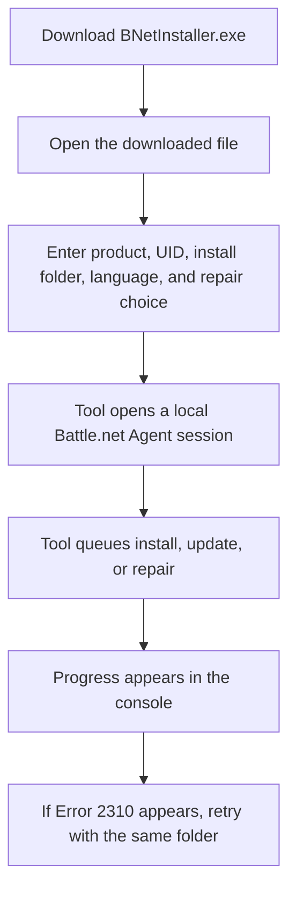

# Battle.Net Installer

[Русская версия](README.ru.md)

Simple tool for installing, updating, or repairing Blizzard games through the locally installed Battle.net Agent.

This repository is an unofficial maintenance fork of [barncastle/Battle.Net-Installer](https://github.com/barncastle/Battle.Net-Installer) and includes a maintained fix for `Error 2310`.

## Download

Download the latest `BNetInstaller.exe` from [Releases](https://github.com/DokPlay/Battle.Net-Installer/releases/latest).

## Quick Start

1. Install Battle.net.
2. Sign in to your Battle.net account once.
3. Download `BNetInstaller.exe`.
4. Double-click `BNetInstaller.exe`.
5. Enter the values the program asks for.
6. Wait for the download or install progress to appear.

## When You Open the Downloaded File

The program opens a console window and asks for values one by one. A typical run looks like this:

```text
Please complete the following information:
TACT Product (example: s2): fenris
Agent UID (example: s2_enUS, blank = same as product): fenris
Installation Directory (example: D:\Battle.net\StarCraft II): D:\Diablo IV
Game/Asset Language (example: enUS): ruRU
Repair Install? (Y/N, default N): n
```

What this means:

- `fenris` is the value for `TACT Product (example: s2)`.
- `fenris` is also the value for `Agent UID (example: s2_enUS, blank = same as product)`.
- `D:\Diablo IV` is the value for `Installation Directory (example: D:\Battle.net\StarCraft II)`. You can use another drive or folder, for example `C:\Diablo IV` or `E:\Games\Diablo IV`.
- `ruRU` is the value for `Game/Asset Language (example: enUS)`. Other examples are `enUS`, `deDE`, `frFR`, `esES`, `ptBR`, `itIT`, `koKR`, `plPL`, `zhCN`, and `zhTW`.
- `n` is the value for `Repair Install? (Y/N, default N)` and means no repair, because the game is not installed yet.

## Installation Flow



## Error 2310

If you get `Error 2310`:

1. Make sure you are signed in to Battle.net.
2. Run the tool again with the same folder.
3. If the error still appears, open Battle.net and try `Locate the game` for that same folder.
4. Then run `BNetInstaller.exe` again.

## Requirements

- Windows
- Battle.net installed
- Signed in to Battle.net at least once

If you are using the release `EXE`, you do not need to install the .NET runtime separately because the release build is self-contained.

## Note

Use this tool only with products that are already available to your Blizzard account.

## Attribution

Original project: [barncastle/Battle.Net-Installer](https://github.com/barncastle/Battle.Net-Installer)
Error 2310 fix reference: [xCortlandx/Battle.Net-Installer](https://github.com/xCortlandx/Battle.Net-Installer)
