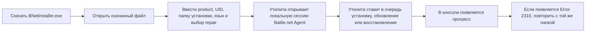

# Battle.Net Installer

[English version](README.md)

Простая утилита для установки, обновления или восстановления игр Blizzard через локально установленный Battle.net Agent.

Этот репозиторий является неофициальным поддерживаемым форком [barncastle/Battle.Net-Installer](https://github.com/barncastle/Battle.Net-Installer) и содержит поддерживаемый фикс для `Error 2310`.

## Советы по запуску

- Установите Battle.net и один раз войдите в аккаунт.
- Скачайте релизный `BNetInstaller.exe` и держите его в удобной папке.
- Дважды нажмите `BNetInstaller.exe`, затем вводите значения в открывшейся консоли.
- Сразу укажите ту папку, в которую хотите поставить игру, а дальше утилита всё сделает сама.

## Скачать

Скачайте последний `BNetInstaller.exe` на странице [Releases](https://github.com/DokPlay/Battle.Net-Installer/releases/latest).

## Быстрый старт

1. Установите Battle.net.
2. Один раз войдите в свой аккаунт Battle.net.
3. Скачайте `BNetInstaller.exe`.
4. Дважды нажмите на `BNetInstaller.exe`.
5. Введите значения, которые попросит программа.
6. Дождитесь появления прогресса загрузки или установки.

## Что будет при открытии скачанного файла

Программа откроет окно консоли и будет по очереди спрашивать значения. Обычно это выглядит так:

```text
Please complete the following information:
TACT Product (example: s2): fenris
Agent UID (example: s2_enUS, blank = same as product): fenris
Installation Directory (example: D:\Battle.net\StarCraft II): D:\Diablo IV
Game/Asset Language (example: enUS): ruRU
Repair Install? (Y/N, default N): n
```

Что это значит:

- `fenris` - это значение для `TACT Product (example: s2)`.
- `fenris` - это также значение для `Agent UID (example: s2_enUS, blank = same as product)`.
- `D:\Diablo IV` - это значение для `Installation Directory (example: D:\Battle.net\StarCraft II)`. Можно указать другой диск или другую папку, например `C:\Diablo IV` или `E:\Games\Diablo IV`.
- `ruRU` - это значение для `Game/Asset Language (example: enUS)`. Ещё примеры: `enUS`, `deDE`, `frFR`, `esES`, `ptBR`, `itIT`, `koKR`, `plPL`, `zhCN`, `zhTW`.
- `n` - это значение для `Repair Install? (Y/N, default N)` и означает, что восстановление не нужно, потому что игра ещё не установлена.

## Схема установки



## После установки

Эта утилита отвечает только за установку и обновление. То, как игра отображается в лаунчере Battle.net, зависит от самого Battle.net, вашего аккаунта и региона.

> [!IMPORTANT]
> **ВАЖНО:** Если после установки Diablo IV игра не отображается в Battle.net, в пользовательской практике также встречается применение сторонних утилит, например `Blizzless Unlocker`.

1. Откройте приложение Battle.net и перейдите на вкладку `Diablo IV`.
2. Нажмите на значок шестерёнки рядом с кнопкой `Играть`.
3. Откройте `Настройки игры`.
4. Выберите нужный язык в `Язык текста`.
5. При необходимости выберите нужный язык в `Язык озвучки`.
6. Нажмите `Готово` и дождитесь, пока Battle.net скачает нужные языковые файлы.

## Требования

- Windows
- установленный Battle.net
- выполненный вход в Battle.net хотя бы один раз

Если вы используете готовый релизный `EXE`, отдельно ставить .NET runtime не нужно, потому что релизная сборка self-contained.

## Примечание

Используйте утилиту только для продуктов, которые уже доступны вашему аккаунту Blizzard.

## Благодарность

Исходный проект: [barncastle/Battle.Net-Installer](https://github.com/barncastle/Battle.Net-Installer)
Исправление `Error 2310`: [xCortlandx/Battle.Net-Installer](https://github.com/xCortlandx/Battle.Net-Installer)
