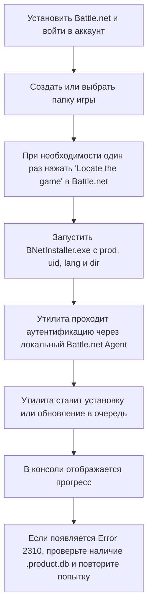

# Battle.Net Installer

[English](README.md) | [Русская версия](README.ru.md)

Утилита для установки, обновления и восстановления игр Blizzard через локально установленный Battle.net Agent.

Этот репозиторий является неофициальным поддерживаемым форком [barncastle/Battle.Net-Installer](https://github.com/barncastle/Battle.Net-Installer). В нём сохранена история исходного проекта, а также добавлены поддерживаемый фикс для Battle.net `Error 2310` и несколько улучшений сценария установки.

## Поддерживаемый форк

- Исходный проект: [barncastle/Battle.Net-Installer](https://github.com/barncastle/Battle.Net-Installer)
- Поддерживаемый форк: [DokPlay/Battle.Net-Installer](https://github.com/DokPlay/Battle.Net-Installer)
- Рекомендуемый бинарник: скачивайте последнюю сборку на странице [Releases](https://github.com/DokPlay/Battle.Net-Installer/releases/latest)

На момент написания в upstream-репозитории нет явного файла `LICENSE`. Поэтому этот репозиторий нужно рассматривать как поддерживаемый форк исходного проекта, а не как заново перелицензированный код.

## Что делает эта утилита

Программа работает с локально установленным Battle.net Agent и умеет:

- ставить игру в очередь на установку
- продолжать обновление в уже существующей папке
- запускать восстановление файлов
- показывать прогресс в консоли

Используйте её только для продуктов, которые уже доступны вашему аккаунту Blizzard. Доступность конкретной игры всё равно может зависеть от аккаунта, платформы и региональной политики Blizzard.

## Быстрый старт

Если вы используете готовый `EXE` из Releases, устанавливать отдельно .NET runtime не нужно, потому что релизная сборка self-contained.

### Что нужно сделать до запуска

1. Установите Battle.net Desktop App.
2. Войдите в Battle.net хотя бы один раз.
3. Создайте или выберите папку, куда будет ставиться игра.
4. Если Battle.net не распознаёт эту папку, откройте Battle.net и один раз используйте `Locate the game` для этой папки.
5. Если всё прошло успешно, в папке обычно появляется скрытый файл `.product.db`.

### Как скачать и запустить готовый EXE

1. Скачайте последний `BNetInstaller.exe` со страницы [Releases](https://github.com/DokPlay/Battle.Net-Installer/releases/latest).
2. Положите `EXE` в любую удобную папку, например `C:\Tools\BNetInstaller`.
3. Откройте `Командную строку` или `PowerShell`.
4. Перейдите в папку, где лежит `EXE`.
5. Запустите команду с параметрами вашей игры.

Пример для `cmd.exe`:

```bat
cd /d C:\Tools\BNetInstaller
BNetInstaller.exe --prod s2 --uid s2_enUS --lang enUS --dir "D:\Battle.net\StarCraft II"
```

Пример для PowerShell:

```powershell
Set-Location "C:\Tools\BNetInstaller"
.\BNetInstaller.exe --prod s2 --uid s2_enUS --lang enUS --dir "D:\Battle.net\StarCraft II"
```

### Если просто дважды нажать по EXE

Если запустить `BNetInstaller.exe` без аргументов, откроется окно консоли и программа по очереди спросит:

1. `TACT Product`
2. `Agent UID`
3. `Installation Directory`
4. `Game/Asset Language`
5. `Repair Install? (Y/N)`

Если `Agent UID` совпадает с TACT product, это поле можно оставить пустым и просто нажать `Enter`.

## Схема установки



## Синтаксис команды

```text
BNetInstaller.exe --prod <TACT_PRODUCT> --uid <AGENT_UID> --lang <LOCALE> --dir "<INSTALL_DIRECTORY>"
```

### Аргументы

| Аргумент | Обязателен | Описание |
| ------- | ------- | ----------- |
| `--prod` | Да | Код TACT product |
| `--uid` | Да | UID Battle.net Agent. Может отличаться от TACT product |
| `--lang` | Да | Язык игры или ассетов |
| `--dir` | Да | Папка установки |
| `--repair` | Нет | Запустить восстановление вместо установки или обновления |
| `--verbose` | Нет | Показывать подробный прогресс |
| `--post-download` | Нет | Запустить файл или приложение после успешной загрузки |
| `--help` | Нет | Показать справку |

### Поддерживаемые значения `--lang`

Поддерживаются такие значения:

`arSA`, `enSA`, `deDE`, `enUS`, `esMX`, `ptBR`, `esES`, `frFR`, `itIT`, `koKR`, `plPL`, `ruRU`, `zhCN`, `zhTW`

Этот форк сам нормализует регистр locale, поэтому в запросы к агенту значение уходит в нужном Battle.net формате.

## Где взять `--prod` и `--uid`

- TACT products и Agent UID можно посмотреть на [wowdev.wiki/TACT#Products](https://wowdev.wiki/TACT#Products)
- обычно работают только активные продукты
- некоторые Agent UID содержат суффикс locale, например `s2_enUS`
- если в целевой папке уже лежит продукт и для него доступно обновление, программа обычно продолжит обновление, а не начнёт полностью новую установку

## Частые примеры

### Установка или продолжение загрузки

```bat
BNetInstaller.exe --prod s2 --uid s2_enUS --lang enUS --dir "D:\Battle.net\StarCraft II"
```

### Восстановление файлов

```bat
BNetInstaller.exe --prod s2 --uid s2_enUS --lang enUS --dir "D:\Battle.net\StarCraft II" --repair
```

### Подробный вывод прогресса

```bat
BNetInstaller.exe --prod s2 --uid s2_enUS --lang enUS --dir "D:\Battle.net\StarCraft II" --verbose
```

## Error 2310

### Что это обычно значит

`Error 2310` обычно означает, что Battle.net Agent отклонил запрос на установку для выбранной папки или её install metadata.

### Что делать

1. Откройте Battle.net.
2. Перейдите на страницу нужной игры.
3. Нажмите `Locate the game`.
4. Выберите ту же папку, которую планируете использовать в этой утилите.
5. Убедитесь, что в папке появился скрытый файл `.product.db`.
6. Снова запустите `BNetInstaller.exe` с той же папкой.

Этот форк также показывает предупреждение заранее, если `.product.db` не найден, и выводит более понятное сообщение, когда возникает `2310`.

## Сборка из исходников

Если хотите собирать проект самостоятельно, нужен .NET 8 SDK.

### Требования

- Windows
- [.NET 8 SDK](https://dotnet.microsoft.com/download/dotnet)
- установленный Battle.net Desktop App
- выполненный вход в Battle.net

### Сборка

```powershell
git clone https://github.com/DokPlay/Battle.Net-Installer.git
cd Battle.Net-Installer
dotnet build BNetInstaller.sln -c Release
```

### Публикация self-contained single-file EXE

```powershell
dotnet publish BNetInstaller\BNetInstaller.csproj -c Release -r win-x64 --self-contained true /p:PublishSingleFile=true
```

Итоговый файл будет здесь:

```text
BNetInstaller\bin\Release\net8.0\win-x64\publish\BNetInstaller.exe
```

## Безопасность и прозрачность

Этот форк оставляет утилиту в рамках исходной задачи:

- она запускает локально установленный Blizzard `Agent.exe`
- она общается с агентом через локальный `127.0.0.1`
- она использует patch endpoint Blizzard, необходимый для установки

В этой поддерживаемой версии не добавлены дополнительные telemetry-сервисы, webhook-адреса, задачи планировщика, постоянная запись в реестр или новые сторонние package dependencies по сравнению с тем путём кода, который был проверен при интеграции.

## Решение типовых проблем

- `Unable to find Agent.exe`
  Battle.net не установлен или файлы Agent не найдены.

- `Unable to start Agent.exe`
  Battle.net установлен, но агент не удалось запустить.

- `Unable to authenticate`
  Сначала войдите в Battle.net, затем попробуйте снова.

- `2221`
  Указан неверный или недоступный TACT product.

- `2310`
  Battle.net Agent отклонил запрос для выбранной папки. Используйте `Locate the game`, убедитесь, что `.product.db` существует, затем попробуйте снова.

- `2421`
  На диске может не хватать места, либо система не проходит минимальные требования.

- `3001`
  Для указанного продукта требуется отсутствующий encryption key.

Логи Battle.net Agent обычно находятся здесь:

```text
%programdata%\Battle.net\Agent\Agent.xxxx
```

## Благодарность

Полная заслуга за исходный проект принадлежит автору и контрибьюторам [barncastle/Battle.Net-Installer](https://github.com/barncastle/Battle.Net-Installer).
